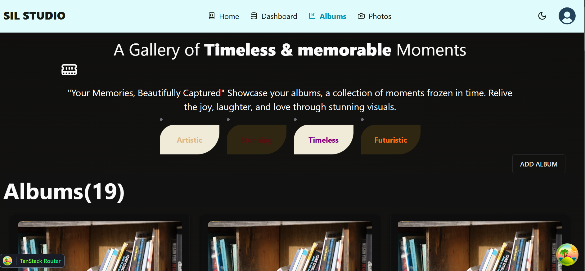

<a href="https://aimeos.org/">
    
</a>


# SIL STUDIO


[](https://scrutinizer-ci.com/g/aimeos/aimeos-typo3/?branch=master)
[](https://packagist.org/packages/aimeos/aimeos-typo3)

:star: Star me on GitHub — it motivates me a lot!

[SIL STUDIO](https://aimeos.org/TYPO3) SIL Studio is a modern photo management application that allows users to create albums and add photos to those albums. Built with a robust backend powered by FastAPI and a sleek, high-performance frontend developed using React and Vite, SIL Studio provides an intuitive user experience for organizing and showcasing your memories.

[](https://github.com/Bettenoch/sil-frontend-assessment)
## Table Of Content

## Technology Stack and Features

- ⚡ [**FastAPI**](https://fastapi.tiangolo.com) for the Python backend API.
    - 🧰 [SQLModel](https://sqlmodel.tiangolo.com) for the Python SQL database interactions (ORM).
    - 🔍 [Pydantic](https://docs.pydantic.dev), used by FastAPI, for the data validation and settings management.
    - 💾 [PostgreSQL](https://www.postgresql.org) as the SQL database.
- 🚀 [React](https://react.dev) for the frontend.
    - 💃 Using TypeScript, hooks, Vite, and other parts of a modern frontend stack.
    - 🎨 [Chakra UI](https://chakra-ui.com) for the frontend components.
    - 🤖 An automatically generated frontend client.
    - 🧪 [Playwright](https://playwright.dev) for End-to-End testing.
    - 🦇 Dark mode support.
- 🐋 [Docker Compose](https://www.docker.com) for development and production.
- 🔒 Secure password hashing by default.
- 🔑 JWT (JSON Web Token) authentication.
- 📫 Email based password recovery.
- ✅ Tests with [Pytest](https://pytest.org).
- 📞 [Traefik](https://traefik.io) as a reverse proxy / load balancer.
- 🚢 Deployment instructions using Docker Compose, including how to set up a frontend Traefik proxy to handle automatic HTTPS certificates.
- 🏭 CI (continuous integration) and CD (continuous deployment) based on GitHub Actions.
- Users Dasbhoard
- Albums Page
- User Albums page
- Photos page
- UserId Dasbhoard
- AlbumID Page
- PhotoID page


### BACKEND LINK
 [Backend Link](https://github.com/Bettenoch/sil-backend-assessment)
### Home page dark mode

[](https://github.com/Bettenoch/sil-frontend-assessment)

### HOME LIGHT MODE

[](https://github.com/Bettenoch/sil-frontend-assessment)

### Dashboard - Users

[](https://github.com/Bettenoch/sil-frontend-assessment)

### Dashboard - Albums

[](https://github.com/Bettenoch/sil-frontend-assessment)

### Dashboard - Photos

[](https://github.com/Bettenoch/sil-frontend-assessment)


### Interactive API Documentation

[](https://github.com/Bettenoch/sil-frontend-assessment)

## How To Use It

You can **just fork or clone** this repository and use it as is.

✨ It just works. ✨


## How To Use It - Alternative With Copier

This repository also supports generating a new project using [Copier](https://copier.readthedocs.io).

It will copy all the files, ask you configuration questions, and update the `.env` files with your answers.

### Install Copier

You can install Copier with:

```bash
pip install copier
```

Or better, if you have [`pipx`](https://pipx.pypa.io/), you can run it with:

```bash
pipx install copier
```

**Note**: If you have `pipx`, installing copier is optional, you could run it directly.

### Generate a Project With Copier

Decide a name for your new project's directory, you will use it below. For example, `my-awesome-project`.

Go to the directory that will be the parent of your project, and run the command with your project's name:

```bash
copier copy https://github.com/fastapi/full-stack-fastapi-template my-awesome-project --trust
```

If you have `pipx` and you didn't install `copier`, you can run it directly:

```bash
pipx run copier copy https://github.com/fastapi/full-stack-fastapi-template my-awesome-project --trust
```

**Note** the `--trust` option is necessary to be able to execute a [post-creation script](https://github.com/fastapi/full-stack-fastapi-template/blob/master/.copier/update_dotenv.py) that updates your `.env` files.

### Input Variables

Copier will ask you for some data, you might want to have at hand before generating the project.

But don't worry, you can just update any of that in the `.env` files afterwards.

The input variables, with their default values (some auto generated) are:

- `project_name`: (default: `"FastAPI Project"`) The name of the project, shown to API users (in .env).
- `stack_name`: (default: `"fastapi-project"`) The name of the stack used for Docker Compose labels and project name (no spaces, no periods) (in .env).
- `secret_key`: (default: `"changethis"`) The secret key for the project, used for security, stored in .env, you can generate one with the method above.
- `first_superuser`: (default: `"admin@example.com"`) The email of the first superuser (in .env).
- `first_superuser_password`: (default: `"changethis"`) The password of the first superuser (in .env).
- `smtp_host`: (default: "") The SMTP server host to send emails, you can set it later in .env.
- `smtp_user`: (default: "") The SMTP server user to send emails, you can set it later in .env.
- `smtp_password`: (default: "") The SMTP server password to send emails, you can set it later in .env.
- `emails_from_email`: (default: `"info@example.com"`) The email account to send emails from, you can set it later in .env.
- `postgres_password`: (default: `"changethis"`) The password for the PostgreSQL database, stored in .env, you can generate one with the method above.
- `sentry_dsn`: (default: "") The DSN for Sentry, if you are using it, you can set it later in .env.

## Backend Development

Backend docs: [backend/README.md](./backend/README.md).

## Frontend Development

Frontend docs: [frontend/README.md](./frontend/README.md).

## Deployment

Deployment docs: [deployment.md](./deployment.md).

## Development

General development docs: [development.md](./development.md).

This includes using Docker Compose, custom local domains, `.env` configurations, etc.

## Release Notes

Check the file [release-notes.md](./release-notes.md).

## License

The Full Stack FastAPI Template is licensed under the terms of the MIT license.